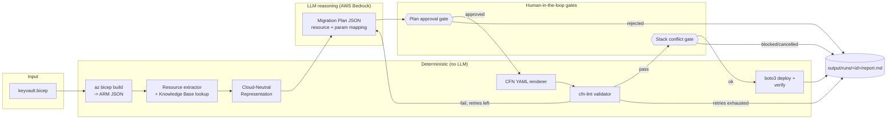
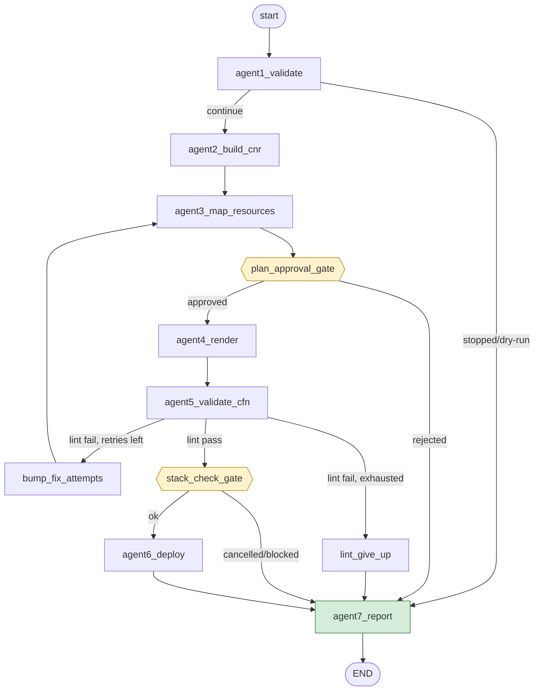

# Azure Bicep → AWS CloudFormation Migration Agent

An agentic, human-gated pipeline that migrates Azure Bicep infrastructure-as-code to AWS
CloudFormation. A [LangGraph](https://langchain-ai.github.io/langgraph/) state graph of 7
agents wraps deterministic parsing/rendering/validation code around a single LLM reasoning
step (AWS Bedrock), with mandatory human approval on the migration plan and the target
stack before any CloudFormation is generated or deployed. Deployment itself (parameter
resolution + `create_stack`/`update_stack`) is fully automatic once those gates pass — no
confirmation prompt, no interactive parameter entry.

> See [CAPSTONE_PLAN.md](CAPSTONE_PLAN.md) for the full target design (guardrails, confidence
> scoring, multi-resource knowledge-base growth, evaluation harness). This README describes
> what is **actually implemented today** vs. what's still planned.

## Table of contents
- [High-level architecture](#high-level-architecture)
- [The LangGraph agent graph](#the-langgraph-agent-graph)
- [Workflows](#workflows)
- [Non-interactive parameter resolution](#non-interactive-parameter-resolution)
- [Project structure](#project-structure)
- [Prerequisites](#prerequisites)
- [Setup](#setup)
- [Steps to run](#steps-to-run)
- [Environment variables](#environment-variables)
- [Knowledge base](#knowledge-base)
- [Current progress](#current-progress)
- [Next steps to reach an end-to-end application](#next-steps-to-reach-an-end-to-end-application)
- [Troubleshooting](#troubleshooting)

## High-level architecture

The key design rule: **the LLM only ever reasons and emits a structured JSON "migration
plan" — it never writes CloudFormation syntax directly.** Everything downstream of the LLM
(rendering YAML, linting, deploying) is deterministic code, which keeps the pipeline
auditable and replayable.



## The LangGraph agent graph

`orchestrator/graph.py` wires 7 agents + 2 human-approval gates into a single
`StateGraph` (state shape defined in [orchestrator/state.py](orchestrator/state.py)):

| Step | Node | Type | Responsibility |
|---|---|---|---|
| 1 | `agent1_validate` | deterministic | Compile Bicep → ARM JSON, check every resource type has a knowledge-base mapping; prompts to continue if some don't |
| 2 | `agent2_build_cnr` | deterministic | Build a Cloud-Neutral Representation (CNR) — one language-agnostic template per resource |
| 3 | `agent3_map_resources` | **LLM (Bedrock)** | Map each Azure resource to an AWS equivalent, emit a `MigrationPlan` JSON (resources, params, outputs, conditions) |
| — | `plan_approval_gate` | **human gate** | Print the plan + mapping table, require explicit `y` before any CFN is generated |
| 4 | `agent4_render` | deterministic | Render the approved plan into CloudFormation YAML (no LLM involved) |
| 5 | `agent5_validate_cfn` | deterministic | Run `cfn-lint`; on failure, loop back to Agent 3 with the error feedback (self-correction), up to `MAX_FIX_ATTEMPTS` |
| — | `stack_check_gate` | **human gate** | Look up the target CFN stack; if it exists, ask to update in place or delete-and-recreate (auto-detects stuck states like `ROLLBACK_COMPLETE`) |
| 6 | `agent6_deploy` | deterministic | Real `boto3` `create_stack`/`update_stack` -- fully automatic parameter resolution (`--params-file` → `CFN_PARAM_<NAME>` env var → source Key Vault secret/name → template Default), verifies secrets post-deploy |
| 7 | `agent7_report` | deterministic | Write `output/runs/<run_id>/report.md` from the full `agent_log` |



State flows as a single `MigrationState` `TypedDict`; each agent returns a partial dict
that LangGraph merges in. `agent_log` uses an `operator.add` reducer so every agent's
log entry accumulates instead of overwriting.

## Workflows

### 1. Dry run (no LLM, no AWS calls)
Only Agent 1 runs: compiles the Bicep file and checks knowledge-base coverage, then writes
a report. Useful for quickly validating a new `.bicep` file before spending an LLM call.

```powershell
python migrate_agents.py keyvault.bicep --dry-run
```

### 2. Full run (LLM + human approval gates + automatic deploy)
Runs the entire graph above. You will be prompted at up to three points:
1. **Unsupported resource types** (Agent 1) — continue with supported resources only, or stop.
2. **Plan approval gate** — review the LLM's resource/AWS mapping table before any YAML is generated.
3. **Stack conflict gate** — choose update vs. delete-recreate vs. cancel if the target stack
   already exists (only prompts when there's actually a conflict to resolve).

Once those pass, **Agent 6 deploys automatically** — no confirmation prompt, no interactive
parameter entry. See [Non-interactive parameter resolution](#non-interactive-parameter-resolution)
for where CFN template parameter values come from.

```powershell
python migrate_agents.py keyvault.bicep
```

### 3. Self-correction retry loop
If `cfn-lint` fails after the plan is approved, the graph loops back to Agent 3 with the
lint error appended to the prompt, asking the LLM for a corrected plan. This repeats up to
`MAX_FIX_ATTEMPTS` (default 2) times before giving up and writing a "stopped" report.

### 4. Legacy linear pipeline (`migrate.py`)
An older, non-agentic version of the same deterministic-render / LLM-reasoning split still
exists (`migrate.py` → `orchestrator/pipeline.py`), kept for backward compatibility. It has
no human approval gates and no deploy step — prefer `migrate_agents.py` for anything new.


```powershell
python migrate.py keyvault.bicep --dry-run
```

## Non-interactive parameter resolution

Agent 6 never prompts for a CFN template parameter value. For each parameter, it resolves a
value in this priority order and fails the run fast (clear error, no silent fallback) if
nothing applies:

1. **`--params-file <path.json>`** — a flat JSON object, e.g. `{"SecretNamePrefix": "myapp/prod"}`.
2. **`CFN_PARAM_<NAME>`** environment variable (e.g. `CFN_PARAM_SECRETNAMEPREFIX`).
3. **Source Key Vault secret** (`NoEcho`/secret parameters only, resource-group export flow
   only) — Agent 0 reads every secret's real value from the source Key Vault's data plane
   (`az keyvault secret show`) and matches it to a parameter by normalized name (e.g.
   `DbPassword` ↔ `db-password`). Requires the `az` CLI identity to hold a data-plane role
   such as **Key Vault Secrets User** on the vault; any fetch failure (e.g. `Forbidden`) is
   logged as a warning by Agent 0, not raised.
4. **Template `Default`** (never used for `NoEcho`/secret parameters, mirroring the old
   interactive behavior).
5. **Source resource group / Key Vault name** — only for non-secret parameters whose name
   looks like a naming/prefix param (contains "prefix" or "namespace", e.g.
   `SecretNamePrefix`) *and* have no `Default`. This is a narrow heuristic; anything else
   unresolved still fails fast rather than guessing.

Every resolved value is still checked against the parameter's own `MinLength`/`MaxLength`/
`AllowedPattern`/`AllowedValues` before `CreateStack`/`UpdateStack`.

Only `stack_check_gate` remains interactive (choosing update/delete-recreate/cancel when the
target stack already exists) — that's intentional, since it can be destructive.

## Project structure

```
.
├── README.md                     # This file
├── CAPSTONE_PLAN.md              # Full target design (guardrails, confidence, VPC/Functions, evaluation)
├── migrate_agents.py              # CLI entrypoint — 7-agent LangGraph pipeline (primary)
├── migrate.py                     # CLI entrypoint — legacy linear pipeline (kept for compat)
├── keyvault.bicep                 # Example input template (Key Vault + 2 secrets)
├── bicep-to-cloudformation.md     # Human-authored Key Vault -> Secrets Manager mapping doc
├── requirements.txt
├── knowledge_base/
│   └── index.json                 # ARM resource type -> mapping doc path
├── orchestrator/
│   ├── state.py                   # MigrationState TypedDict (shared graph state)
│   ├── agents.py                  # agent1..agent7 + plan_approval_gate/stack_check_gate
│   ├── graph.py                   # build_graph() — StateGraph wiring, routing, retry loop
│   ├── bicep_compiler.py          # az bicep build -> ARM JSON
│   ├── resource_extractor.py      # Walk ARM JSON, collect resource types
│   ├── knowledge_base.py          # Load index.json, map types -> docs
│   ├── cloud_neutral.py           # Build the Cloud-Neutral Representation (CNR)
│   ├── migration_plan.py          # MigrationPlan dataclass, JSON schema hint, parsing/validation
│   ├── generator.py               # Generator ABC + BedrockGenerator (pluggable LLM backend)
│   ├── cfn_generator.py           # Deterministic MigrationPlan -> CloudFormation YAML
│   ├── validator.py               # cfn-lint integration
│   ├── azure_export.py            # az group export/decompile + source Key Vault secret fetch
│   ├── config.py                  # Env-var driven Config (region, model id, retry limit)
│   └── pipeline.py                # Legacy linear pipeline used by migrate.py
└── output/
    ├── keyvault.generated.yaml    # Last generated CFN template
    └── runs/<run_id>/report.md    # Per-run report written by agent7_report
```

## Prerequisites

- **Python 3.8+**
- **Azure CLI 2.90.0+** with the `bicep` extension (`az bicep build` must work)
- **AWS credentials** configured (`aws configure` or environment variables) — required for
  full runs (LLM via Bedrock + real deploy); not needed for `--dry-run`
- **AWS Bedrock access** to the configured model (`bedrock:InvokeModel`)
- **IAM permissions** for CloudFormation (`cloudformation:CreateStack`/`UpdateStack`/
  `DescribeStacks`/`DeleteStack`) and Secrets Manager if verifying deployed secrets

## Setup

```powershell
# 1. Create and activate a virtual environment
python -m venv .venv
.venv\Scripts\activate

# 2. Install dependencies
pip install -r requirements.txt

# 3. Verify Azure CLI + Bicep
az version
az bicep version

# 4. Configure AWS credentials (skip if only running --dry-run)
aws configure
```

## Steps to run

```powershell
# Validate the template + knowledge-base coverage only (no LLM, no AWS)
python migrate_agents.py keyvault.bicep --dry-run

# Full migration: LLM plan -> human approval -> render -> lint -> deploy gates -> deploy
python migrate_agents.py keyvault.bicep

# Custom output directory / knowledge-base index
python migrate_agents.py keyvault.bicep --output-dir output --kb-index knowledge_base/index.json
```

Every run writes `output/runs/<run_id>/report.md` summarizing the agent log, resource
mapping table, and final status (completed / stopped + reason).

## Environment variables

| Variable | Default | Purpose |
|---|---|---|
| `AWS_REGION` | `us-east-1` | Region for Bedrock + CloudFormation calls |
| `BEDROCK_MODEL_ID` | `amazon.nova-pro-v1:0` | Bedrock model used by Agent 3 |
| `MAX_FIX_ATTEMPTS` | `2` | Self-correction retries on `cfn-lint` failure before giving up |
| `CFN_PARAM_<NAME>` | — | Non-interactive value for CFN template parameter `<NAME>` (see [Non-interactive parameter resolution](#non-interactive-parameter-resolution)) |

## Knowledge base

`knowledge_base/index.json` maps an ARM `type` string to a markdown doc documenting the
Azure→AWS mapping (conceptual differences, resource/parameter/property mapping). Only
`Microsoft.KeyVault/vaults` and `Microsoft.KeyVault/vaults/secrets` are mapped today, both
pointing at [bicep-to-cloudformation.md](bicep-to-cloudformation.md). A resource type with
no entry triggers the Agent 1 "unsupported type" human prompt.

To add a new resource type:
1. Research the Azure resource and its AWS equivalent.
2. Create a markdown doc in `knowledge_base/` following the structure of
   [bicep-to-cloudformation.md](bicep-to-cloudformation.md) (concept diff, resource/param/
   property mapping, examples).
3. Add an entry to `knowledge_base/index.json`.

## Current progress

What's implemented and verified end-to-end (dry-run and full run, including the retry loop
and fully automatic deployment) as of 2026-09-30:

- ✅ 7-agent LangGraph pipeline (`migrate_agents.py`) covering compile → extract → CNR →
  LLM plan → plan approval gate → render → lint → self-correction retry →
  stack conflict gate → real `boto3` deploy → report.
- ✅ Single resource type in scope: **Azure Key Vault → AWS Secrets Manager** (vault +
  secrets), backed by one human-authored knowledge-base doc.
- ✅ Two mandatory human-in-the-loop checkpoints (plan approval, stack conflict resolution)
  — deployment itself (parameter resolution + create/update-stack) is fully automatic once
  those pass, no confirmation prompt and no interactive parameter entry.
- ✅ Non-interactive CFN parameter resolution: `--params-file` → `CFN_PARAM_<NAME>` env var →
  source Key Vault secret (matched by normalized name, requires `Key Vault Secrets User`-level
  RBAC) → template `Default` → source resource group/vault name (naming/prefix params only).
  Anything still unresolved or invalid fails the run fast instead of blocking on input.
- ✅ Client-side parameter validation (`MinLength`/`MaxLength`/`AllowedPattern`/
  `AllowedValues`) before `CreateStack`/`UpdateStack` to avoid `ROLLBACK_COMPLETE` stacks
  from LLM-generated defaults that violate their own constraints.
- ✅ Stack-state detection (`ROLLBACK_COMPLETE`/`CREATE_FAILED`/`DELETE_FAILED`/
  `*_IN_PROGRESS`) with a human choice to update, delete-and-recreate, or cancel.
- ✅ Legacy non-agentic pipeline (`migrate.py`) retained for backward compatibility.

What's **not** implemented yet (see [CAPSTONE_PLAN.md](CAPSTONE_PLAN.md) for full design):

- ❌ Additional resource types (VPC / Azure Functions → Lambda) and the `kb_draft_node`
  agent-drafted-knowledge-base-doc flow.
- ❌ Guardrail security scanning (`checkov`/`cfn_nag`) and custom secret/IAM/network checks.
- ❌ Composite confidence scoring per resource + calibration history (`history.jsonl`).
- ❌ Dedicated `SecretValue` wrapper + logging redaction filter (secret values are never
  logged/printed today, but only because call sites are careful to log parameter *names*,
  not because of a wrapper type enforcing it end-to-end in state/logs).
- ❌ Post-deploy verification beyond the basic secret existence check in Agent 6
  (no VPC reachability check, no Lambda invoke smoke test — those resource types don't
  exist yet).
- ❌ Automated tests (`pytest`) for deterministic nodes, guardrails, or confidence math.
- ❌ Evaluation report / metrics (pass rate, Brier score, human-intervention rate).

## Next steps to reach an end-to-end application

1. **Expand resource coverage**: author `resources/vpc/main.bicep` and
   `resources/functions/main.bicep`, draft their knowledge-base docs (human-reviewed), and
   add them to `knowledge_base/index.json`.
2. **Guardrails**: add `orchestrator/guardrails.py` (checkov/cfn_nag + custom secret/IAM/
   network checks) and wire a `guardrail_gate` node before `agent6_deploy`.
3. **Confidence scoring**: add `orchestrator/confidence.py` combining LLM self-reported
   confidence, lint/guardrail pass-fail, and historical success rate from
   `output/runs/history.jsonl`; surface it in the plan approval gate.
4. **Secrets hardening**: introduce a `SecretValue` wrapper (`__repr__`/`__str__` return
   `"***"`) and a logging redaction filter so secret values never appear in state dumps or
   logs, not just avoided in `CreateStack` argv.
5. **Verification**: extend Agent 6 (or a new `verify` step) with per-resource-type
   post-deploy smoke tests as new resource types are added (VPC reachability, Lambda
   invoke).
6. **Evaluation harness**: `orchestrator/evaluation.py` to log run outcomes and produce a
   report (pass rate, calibration/Brier score, human-intervention rate, time-to-migrate) —
   needed for any capstone/portfolio write-up.
7. **Automated tests**: `pytest` coverage for deterministic nodes (extractor, CNR builder,
   cfn_generator, validator) and recorded-response fixtures for Agent 3 so the retry loop
   can be tested without live Bedrock calls.
8. **Packaging/UX**: replace raw `input()`/`print()` gates with a `rich`-based CLI table
   (as planned in CAPSTONE_PLAN.md) for a clearer human-review experience.

## Troubleshooting

**`az bicep build` not found** — install the Azure CLI and Bicep extension, then verify
with `az bicep version`.

**Bedrock `ResourceNotFoundException` (model not available)** — verify `AWS_REGION`
supports Bedrock and that `BEDROCK_MODEL_ID` is correct and enabled for your account.

**`cfn-lint` errors vs. warnings** — errors (`E...`) trigger the self-correction retry
loop; warnings (`W...`) are reported but don't block deployment.

**Stack stuck in `ROLLBACK_COMPLETE`/`CREATE_FAILED`/`DELETE_FAILED`** — handled
automatically by `stack_check_gate`, which offers to delete-and-recreate the stack.

**`No value available for required parameter '<Name>'`** — Agent 6 couldn't resolve that
CFN parameter non-interactively. Supply it via `--params-file`/`CFN_PARAM_<NAME>` (see
[Non-interactive parameter resolution](#non-interactive-parameter-resolution)); this is
expected for parameters that aren't secrets, don't match a naming/prefix heuristic, and
have no template `Default` — the LLM-generated plan varies run to run.

**Key Vault secret fetch warning (`Forbidden`/`ForbiddenByRbac`)** — the `az` CLI identity
needs a data-plane role on the source vault (it's not enough to have control-plane/ARM
access). Grant it, e.g.:
```powershell
az role assignment create --role "Key Vault Secrets User" --assignee-object-id <your-oid> --assignee-principal-type User --scope <vault-resource-id>
```
Until granted, secret parameters fall through to `--params-file`/`CFN_PARAM_<NAME>` or fail fast.

---

**Status:** Pilot — Key Vault → Secrets Manager working end-to-end through the 7-agent
graph with plan/stack approval gates and fully automatic deployment; see
[Current progress](#current-progress) above for scope.
